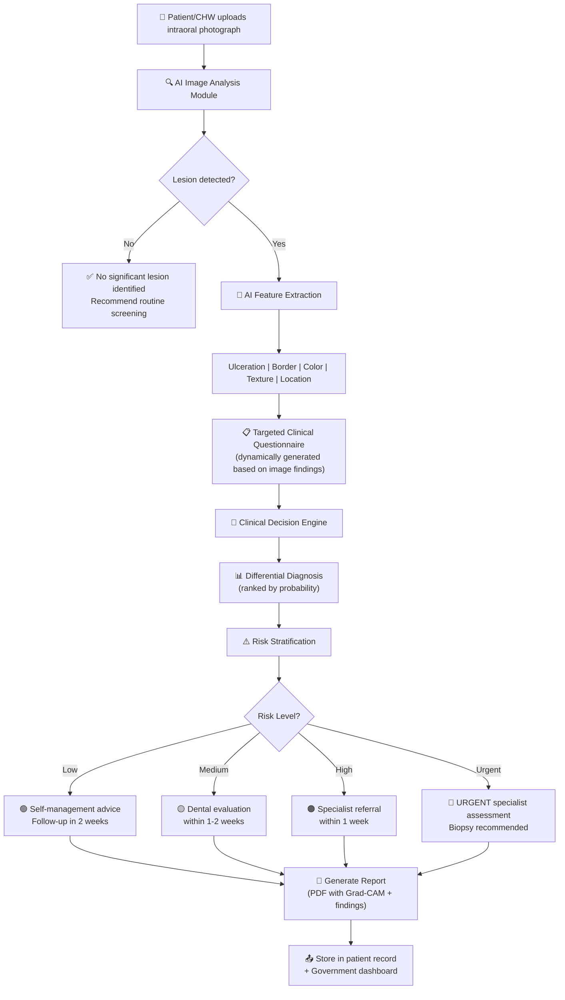
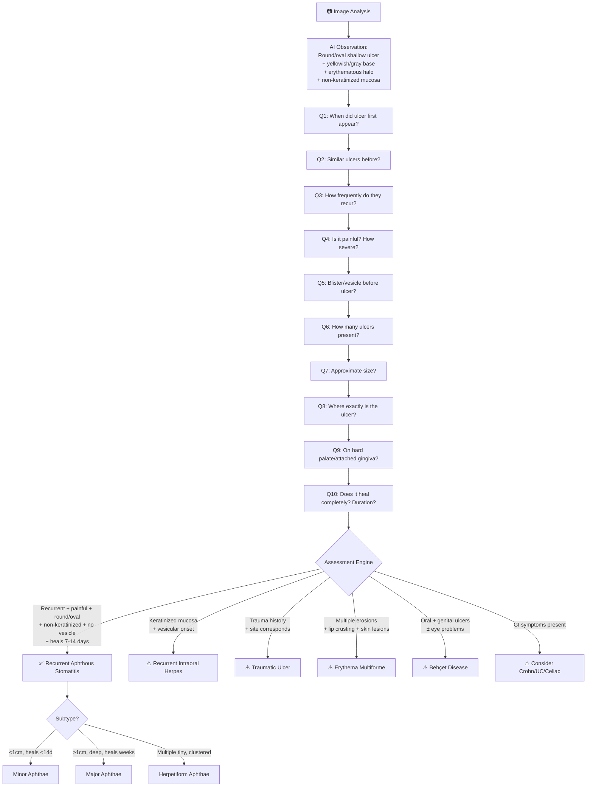
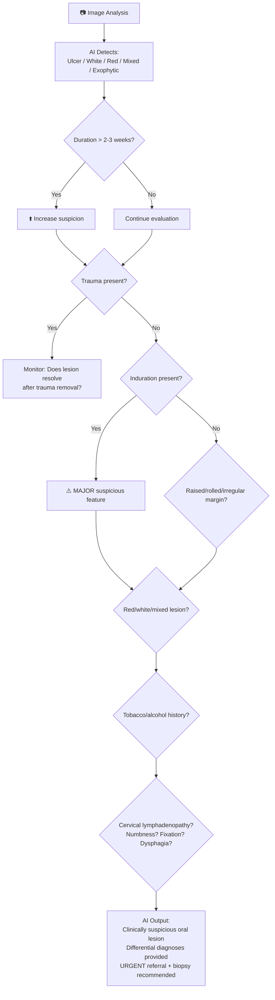
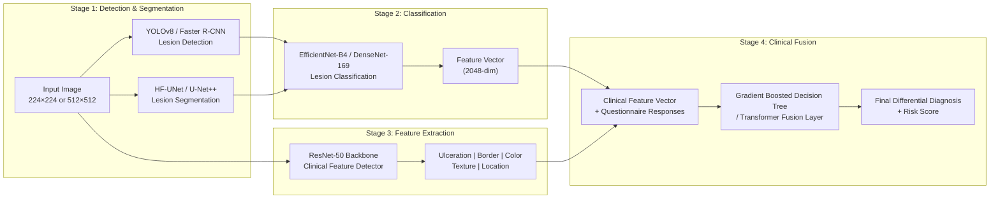
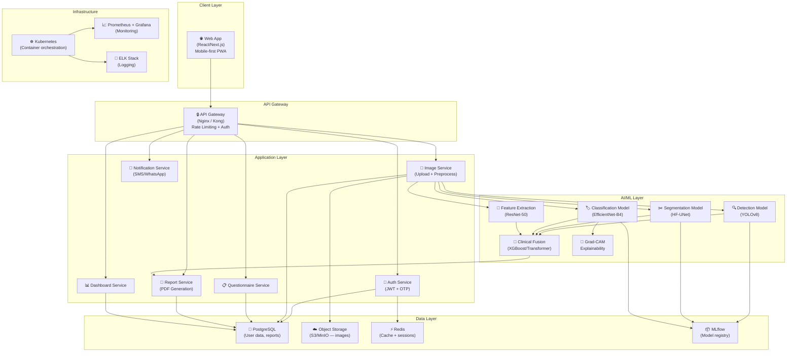
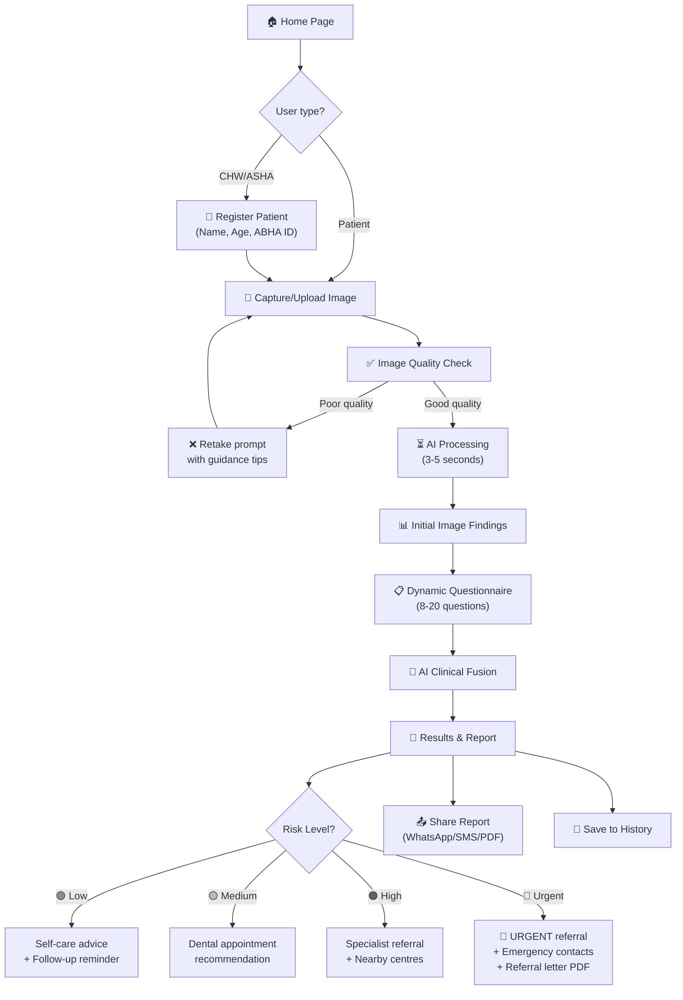
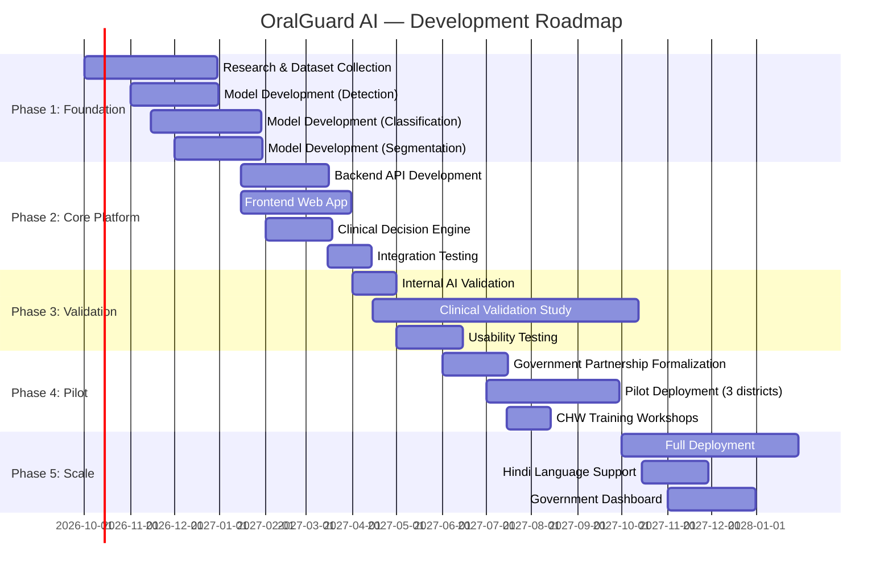

# 🦷 OralGuard AI — Product Requirements Document (PRD)

## AI-Powered Oral Lesion Diagnostic & Clinical Decision Support System

| Field | Detail |
|---|---|
| **Product Name** | OralGuard AI |
| **Version** | 1.0 |
| **Date** | 28 September 2026 |
| **Author** | Gaurav (Project Lead) |
| **Document Status** | Draft v1.0 — For Review |
| **Deployment Target** | Web Application (Browser-based) |
| **Primary Users** | Government health bodies & patients (public screening) |
| **Project Context** | Government health program / public health initiative |

---

## Table of Contents

1. [Executive Summary](#1-executive-summary)
2. [Problem Statement](#2-problem-statement)
3. [Product Vision & Objectives](#3-product-vision--objectives)
4. [Scope & Boundaries](#4-scope--boundaries)
5. [Target Users & Personas](#5-target-users--personas)
6. [Clinical Workflow Architecture](#6-clinical-workflow-architecture)
7. [Functional Requirements](#7-functional-requirements)
8. [AI/ML Model Specifications](#8-aiml-model-specifications)
9. [Clinical Decision Logic](#9-clinical-decision-logic)
10. [Datasets & Training Data](#10-datasets--training-data)
11. [Reference Models & Prior Art](#11-reference-models--prior-art)
12. [Non-Functional Requirements](#12-non-functional-requirements)
13. [System Architecture](#13-system-architecture)
14. [UI/UX Requirements](#14-uiux-requirements)
15. [API Specifications](#15-api-specifications)
16. [Security, Privacy & Compliance](#16-security-privacy--compliance)
17. [Testing & Validation Strategy](#17-testing--validation-strategy)
18. [Risk Assessment & Mitigation](#18-risk-assessment--mitigation)
19. [Release Plan & Milestones](#19-release-plan--milestones)
20. [Success Metrics & KPIs](#20-success-metrics--kpis)
21. [Appendices](#21-appendices)

---

## 1. Executive Summary

**OralGuard AI** is a web-based AI Clinical Decision Support System (AI-CDSS) for oral lesion diagnosis. It combines deep learning–based image analysis with a structured clinical questionnaire to generate differential diagnoses, risk stratification, and referral recommendations for oral mucosal lesions.

The system is designed for deployment in **government public health programs** across India, enabling:
- **Patients** to self-screen oral lesions using smartphone photographs
- **Community Health Workers (CHWs)** and **ASHA workers** to triage patients in rural/semi-urban areas
- **Government health officials** to monitor oral health trends and prioritize specialist referrals

> [!IMPORTANT]
> OralGuard AI is a **diagnostic aid**, not a diagnostic replacement. All outputs carry a mandatory disclaimer that histopathological confirmation is required for definitive diagnosis of malignancy.

### Key Differentiators

| Feature | Simple "Photo → Label" AI | OralGuard AI (This Project) |
|---|---|---|
| Image analysis | ✅ | ✅ |
| Structured clinical history | ❌ | ✅ 20+ targeted questions |
| Differential diagnosis | ❌ | ✅ Ranked differentials |
| Risk stratification | ❌ | ✅ Low / Medium / High / Urgent |
| Referral recommendation | ❌ | ✅ Context-specific |
| Explainability (Grad-CAM) | ❌ | ✅ Visual heatmaps |
| Multi-condition coverage | Limited | ✅ 12+ conditions |
| Government dashboard | ❌ | ✅ Epidemiological analytics |

---

## 2. Problem Statement

### 2.1 The Challenge

Oral cancer is the **most common cancer among men in India** (as per ICMR/NCDIR data), with over **135,000 new cases annually**. The 5-year survival rate is approximately 50%, primarily due to **late-stage diagnosis**. Key barriers include:

- **Shortage of specialists**: India has approximately 1 oral pathologist per 500,000 population in rural areas
- **Delayed presentation**: Patients often present at Stage III/IV due to lack of awareness
- **Missed potentially malignant disorders (OPMDs)**: Leukoplakia, erythroplakia, and oral submucous fibrosis frequently go undiagnosed in primary care
- **Confusion with benign conditions**: Aphthous ulcers, traumatic ulcers, and infectious lesions may mimic early malignancy—and vice versa

### 2.2 The Opportunity

A web-based AI screening tool deployed through:
- **National Oral Health Programme (NOHP)** infrastructure
- **Ayushman Bharat Health & Wellness Centres**
- **PHC/CHC-level screening camps**

…can enable early detection at scale by augmenting non-specialist clinical capacity with AI-driven triage.

### 2.3 Clinical Gap This Product Addresses

```
Current workflow:
Patient with oral lesion → Visits PHC → GP examines → Refers to district hospital
→ Waits weeks/months → Specialist examines → Biopsy → Diagnosis (often late-stage)

Proposed workflow with OralGuard AI:
Patient/CHW captures photo → AI analyzes image → Asks targeted questions
→ Generates differential + risk score → Immediate triage:
   - Low risk → Self-management + follow-up
   - Medium risk → Dental evaluation within 2 weeks
   - High risk → Urgent specialist referral + biopsy
```

---

## 3. Product Vision & Objectives

### 3.1 Vision Statement

> *"To democratize early oral disease detection in India by placing AI-powered clinical expertise in the hands of every patient and health worker, reducing oral cancer mortality through early identification and timely referral."*

### 3.2 Strategic Objectives

| # | Objective | Measurable Target |
|---|---|---|
| O1 | Enable AI-assisted screening at PHC/CHC level | Deploy across 100+ health centres in Year 1 |
| O2 | Reduce time-to-specialist-referral for suspicious lesions | < 48 hours from screening to referral |
| O3 | Achieve clinically acceptable diagnostic accuracy | Sensitivity ≥ 85%, Specificity ≥ 80% for malignancy detection |
| O4 | Support public health surveillance | Real-time dashboards for district/state health officials |
| O5 | Patient self-screening adoption | 50,000+ patient screenings in Year 1 |
| O6 | Cover all major oral mucosal conditions | ≥ 12 diagnostic categories |

### 3.3 Alignment with Government Programs

- **National Oral Health Programme (NOHP)** — population-level screening
- **Ayushman Bharat Digital Mission (ABDM)** — health record interoperability
- **National Cancer Grid (NCG)** — referral pathway integration
- **ASHA/ANM Training Programs** — CHW-level screening enablement

---

## 4. Scope & Boundaries

### 4.1 In Scope (v1.0)

| Category | Items |
|---|---|
| **Lesion Types** | Aphthous ulcers (minor/major/herpetiform), OSCC, leukoplakia, erythroplakia, oral lichen planus, oral submucous fibrosis, traumatic ulcers, herpetic ulcers, pemphigus vulgaris, mucous membrane pemphigoid, Behçet disease, candidiasis |
| **Input Modalities** | Intraoral photograph (smartphone camera), structured clinical questionnaire |
| **Output** | Ranked differential diagnosis, risk score, referral recommendation, Grad-CAM heatmap |
| **Platform** | Responsive web application (mobile-first design) |
| **Languages** | English, Hindi (Phase 1); expandable to regional languages |
| **Users** | Patients, CHWs/ASHA workers, government health officials |

### 4.2 Out of Scope (v1.0)

| Item | Rationale |
|---|---|
| Histopathological image analysis | Requires separate digital pathology pipeline |
| Radiographic (OPG/CBCT) analysis | Different imaging modality; separate project |
| Real-time video analysis | Bandwidth constraints in rural areas |
| Treatment planning / prescription | Requires licensed clinician; legal/regulatory constraints |
| Dental caries / periodontal disease detection | Outside oral mucosal lesion scope |
| Native mobile app | Web-first approach; PWA for offline capability in v1.1 |

### 4.3 Assumptions & Constraints

- Users have smartphones with ≥ 5MP rear camera
- Internet connectivity available (minimum 2G/EDGE for image upload)
- Government IT infrastructure available for hosting
- IRB/Ethics committee approval will be obtained for clinical validation
- Clinical experts (oral pathologists) available for model validation and annotation

---

## 5. Target Users & Personas

### Persona 1: Patient — Ramesh (Self-Screening)

| Attribute | Detail |
|---|---|
| **Age** | 45 years |
| **Location** | Semi-urban, Madhya Pradesh |
| **Occupation** | Farm worker |
| **Habits** | Gutkha user for 15 years |
| **Scenario** | Noticed a persistent white patch on inner cheek for 3 weeks. Unable to visit a dentist (nearest is 40 km away). Wants to know if it is serious. |
| **Need** | Simple, vernacular interface; clear "should I see a doctor?" answer |
| **Tech Comfort** | Low — uses WhatsApp, basic browsing |

### Persona 2: ASHA Worker — Sunita (Community Screening)

| Attribute | Detail |
|---|---|
| **Age** | 32 years |
| **Location** | Rural PHC, Bihar |
| **Role** | Accredited Social Health Activist |
| **Scenario** | Conducting oral cancer screening camp. Needs to screen 50+ individuals per day and flag high-risk cases for specialist review. |
| **Need** | Fast screening workflow; batch reporting; offline capability |
| **Tech Comfort** | Moderate — trained on government health apps |

### Persona 3: District Health Officer — Dr. Sharma (Surveillance)

| Attribute | Detail |
|---|---|
| **Age** | 52 years |
| **Role** | CDHO (Chief District Health Officer) |
| **Scenario** | Needs district-level data on oral lesion prevalence, screening coverage, and referral completion rates. |
| **Need** | Analytics dashboard; CSV/PDF export; geographic heatmaps |
| **Tech Comfort** | High — uses government portals and dashboards |

---

## 6. Clinical Workflow Architecture

### 6.1 End-to-End Diagnostic Workflow



### 6.2 Aphthous Ulcer — AI Diagnostic Pathway



### 6.3 OSCC — AI Diagnostic Pathway



---

## 7. Functional Requirements

### 7.1 Image Capture & Upload Module

| ID | Requirement | Priority | Details |
|---|---|---|---|
| FR-001 | Image upload from device gallery | P0 | Support JPEG, PNG, HEIC; max 20MB |
| FR-002 | Real-time camera capture via browser | P0 | Use `getUserMedia` API; rear camera preferred |
| FR-003 | Image quality validation | P0 | Check resolution (≥640×480), blur detection, adequate lighting |
| FR-004 | Image preprocessing pipeline | P0 | Auto-crop oral cavity region, normalize lighting, resize to model input |
| FR-005 | Multi-image upload | P1 | Allow up to 5 images of same/different lesions |
| FR-006 | Annotation overlay | P1 | User can tap/circle the lesion of concern |
| FR-007 | Image compression for low-bandwidth | P0 | Client-side compression to <2MB before upload |

### 7.2 AI Analysis Module

| ID | Requirement | Priority | Details |
|---|---|---|---|
| FR-010 | Lesion detection & localization | P0 | Bounding box around detected lesion(s) |
| FR-011 | Lesion segmentation | P1 | Pixel-level segmentation mask |
| FR-012 | Feature extraction | P0 | Detect: ulceration, border type, color, texture, induration (visual proxy) |
| FR-013 | Lesion classification | P0 | Multi-class classification across 12+ categories |
| FR-014 | Confidence score | P0 | Per-class probability (0-100%) |
| FR-015 | Grad-CAM heatmap generation | P0 | Visual explanation of AI focus areas |
| FR-016 | Multi-lesion analysis | P1 | Analyze multiple lesions in single image independently |

### 7.3 Clinical Questionnaire Module

| ID | Requirement | Priority | Details |
|---|---|---|---|
| FR-020 | Dynamic question generation | P0 | Questions adapt based on image analysis findings |
| FR-021 | Aphthous ulcer question set | P0 | 20 questions as specified in clinical workflow (Section 6.2) |
| FR-022 | OSCC suspicion question set | P0 | 12+ questions covering duration, pain, size change, trauma, color, consistency, bleeding, sensory symptoms, functional symptoms, tooth symptoms, neck swelling, risk factors |
| FR-023 | Multi-language question display | P1 | English + Hindi; extensible to Marathi, Tamil, Telugu, Bengali |
| FR-024 | Voice-to-text input | P2 | For low-literacy users; browser Speech Recognition API |
| FR-025 | Progress indicator | P0 | Show completion percentage and estimated time |
| FR-026 | Skip/back navigation | P0 | Allow users to skip non-critical questions, go back to modify answers |
| FR-027 | Conditional branching | P0 | If answer X → skip questions Y and Z; show question W instead |

#### 7.3.1 Complete Aphthous Ulcer Question Bank

| Q# | Question | Why It Matters | Response Type |
|---|---|---|---|
| 1 | When did the ulcer first appear? | Distinguish aphthae from persistent ulcers/neoplasia | Duration picker |
| 2 | Have you had similar ulcers before? | Recurrence strongly supports RAS | Yes/No |
| 3 | How frequently do they recur? | Establish recurrent pattern and severity | Frequency picker |
| 4 | Is it painful? How severe? | Aphthae are characteristically painful | Pain scale (0-10) |
| 5 | Did you notice a blister/vesicle before the ulcer? | Vesicular onset suggests herpes | Yes/No/Unsure |
| 6 | How many ulcers are present? | Classify minor/major/herpetiform | Number input |
| 7 | What is the approximate size? | Minor vs major aphthae | Size selector (mm) |
| 8 | Where exactly is the ulcer? | Aphthae commonly involve non-keratinized mucosa | Anatomical diagram selector |
| 9 | Does it occur on hard palate or attached gingiva? | Keratinized sites → herpes more likely | Yes/No |
| 10 | Does it heal completely? How long does healing take? | Minor aphthae heal ~1-2 weeks | Duration picker |
| 11 | Does it leave a scar? | Scarring suggests major aphthae | Yes/No |
| 12 | Any fever, malaise, or sore throat? | Identify systemic/infectious conditions | Yes/No |
| 13 | Any recent trauma, cheek biting, or sharp tooth? | Supports traumatic ulcer | Yes/No + description |
| 14 | Any new toothpaste/medication/food or chemical exposure? | Contact/medication-related ulceration | Yes/No + details |
| 15 | Any GI symptoms — abdominal pain, diarrhea, weight loss? | Crohn disease, ulcerative colitis, celiac disease | Checklist |
| 16 | Any genital ulcers or eye problems? | Behçet disease | Yes/No |
| 17 | Any skin lesions or recurrent genital/oral lesions? | Systemic mucocutaneous disorders | Yes/No |
| 18 | Any tobacco/areca-nut use? | Risk history for persistent oral lesions | Detailed habit questionnaire |
| 19 | Any immunosuppression or recurrent infections? | Immunodeficiency-associated ulceration | Yes/No + details |
| 20 | Any recent stress, illness, sleep deprivation, or menstrual association? | Precipitating factors for recurrent aphthae | Checklist |

#### 7.3.2 Complete OSCC Suspicion Question Bank

| Q# | Question | Clinical Significance | Response Type |
|---|---|---|---|
| 1 | How long has this lesion been present? | >2-3 weeks warrants evaluation | Duration picker |
| 2 | Is the lesion painful? | Painless ≠ benign; early OSCC may be asymptomatic | Pain scale + type |
| 3 | Has the lesion increased in size? | Growth pattern assessment | No/Slowly/Rapidly/Recurrent |
| 4 | Is there a sharp tooth, denture, or biting habit contacting this area? | Distinguish traumatic vs neoplastic | Yes/No + details |
| 5 | What colour is the lesion? | Red, white, mixed → dysplasia/carcinoma association | Image-assisted selector |
| 6 | Is the surface smooth, rough, granular, verrucous, or ulcerated? | Surface morphology classification | Multi-choice |
| 7 | Is the lesion soft or hard/indurated? | **Induration = major warning sign** | Soft/Firm/Hard/Fixed |
| 8 | Does it bleed spontaneously or when touched? | Bleeding assessment | Yes/No/Sometimes |
| 9 | Do you have numbness, tingling, or altered sensation? | Nerve involvement | Yes/No + location |
| 10 | Difficulty swallowing/speaking/chewing/opening mouth/moving tongue? | Functional impairment assessment | Checklist |
| 11 | Has any tooth near the lesion become loose? Non-healing extraction socket? | Occult carcinoma signs | Yes/No |
| 12 | Have you noticed a lump or swelling in your neck? | Cervical lymphadenopathy | Yes/No + duration |

#### 7.3.3 Risk Factor Questions

| Category | Questions |
|---|---|
| **Tobacco** | Smoking? Cigarettes/bidis? Smokeless tobacco? Gutkha/pan masala? Duration & frequency? |
| **Alcohol** | Regular alcohol consumption? Type & frequency? |
| **Other** | Previous OPMD? Previous oral cancer? Previous radiation? Immunosuppression? |

### 7.4 Differential Diagnosis Engine

| ID | Requirement | Priority | Details |
|---|---|---|---|
| FR-030 | Generate ranked differential diagnosis | P0 | Top 5 differentials with probability scores |
| FR-031 | Clinical reasoning display | P0 | Show which features support/oppose each differential |
| FR-032 | Aphthous ulcer subtyping | P0 | Distinguish minor, major, herpetiform |
| FR-033 | OSCC risk scoring | P0 | Composite score from image features + history |
| FR-034 | Cross-condition disambiguation | P0 | Distinguish aphthous vs herpes vs traumatic vs malignant |
| FR-035 | "Red flag" alert system | P0 | Highlight features requiring urgent attention |

#### 7.4.1 Complete Differential Diagnosis Matrix

| Condition | Key Distinguishing Features |
|---|---|
| **Recurrent Aphthous Stomatitis** | Recurrent + painful + round/oval + non-keratinized mucosa + no vesicle + heals 7-14d |
| **Recurrent Intraoral Herpes** | Usually keratinized mucosa + vesicles may precede ulcers + often clustered |
| **Traumatic Ulcer** | History of biting/sharp tooth/appliance + corresponds to site of trauma |
| **Erythema Multiforme** | Multiple oral ulcers + possible hemorrhagic crusting of lips + skin lesions |
| **Pemphigus Vulgaris** | Multiple erosions/ulcers + fragile bullae + possible Nikolsky sign |
| **Mucous Membrane Pemphigoid** | Desquamative gingivitis and erosions + often chronic/recurrent |
| **Behçet Disease** | Recurrent oral aphthae + genital ulcers ± ocular/skin manifestations |
| **Hematological/Systemic Disease** | Recurrent/severe ulcers + nutritional deficiencies/anemia/immunodeficiency |
| **Crohn Disease / UC / Celiac Disease** | Aphthous-like ulcers with GI/systemic features |
| **Persistent Traumatic Ulcer / TUGSE** | Solitary, persistent + often indurated + may mimic malignancy |
| **Oral Squamous Cell Carcinoma** | Persistent + indurated + enlarging + unexplained + non-healing |
| **Oral Leukoplakia** | White plaque that cannot be classified as another condition |
| **Oral Erythroplakia** | Red, often velvety lesion; can harbor severe dysplasia/carcinoma |
| **Verrucous Carcinoma** | Slow-growing broad-based verrucous/exophytic lesion |
| **Oral Lichen Planus** | Erosion/ulcer with characteristic white reticular striae |
| **Oral Submucous Fibrosis** | Progressive fibrosis + restricted mouth opening + history of areca nut |
| **Oral Candidiasis** | White/red mucosal changes + can be wiped off (pseudomembranous) |

### 7.5 Report Generation

| ID | Requirement | Priority | Details |
|---|---|---|---|
| FR-040 | Generate structured diagnostic report | P0 | PDF format, includes image, Grad-CAM, differentials, recommendation |
| FR-041 | Patient-friendly summary | P0 | Plain-language explanation in selected language |
| FR-042 | Clinician summary | P1 | Technical report with clinical terminology |
| FR-043 | QR code for report access | P1 | Shareable link via QR |
| FR-044 | WhatsApp/SMS sharing | P0 | Critical for Indian user base |

### 7.6 Government Dashboard

| ID | Requirement | Priority | Details |
|---|---|---|---|
| FR-050 | Real-time screening analytics | P0 | Total screenings, positive rates, referral rates |
| FR-051 | Geographic heatmap | P1 | District/block-level lesion prevalence visualization |
| FR-052 | Risk distribution charts | P0 | Low/Medium/High/Urgent case distribution |
| FR-053 | Referral tracking | P1 | Track referral completion and outcomes |
| FR-054 | CHW performance metrics | P1 | Screenings per worker, quality scores |
| FR-055 | CSV/PDF data export | P0 | For government reporting |
| FR-056 | ABDM integration hooks | P2 | ABHA ID-linked records |

---

## 8. AI/ML Model Specifications

### 8.1 Model Architecture Overview



### 8.2 Model Component Specifications

#### 8.2.1 Lesion Detection Model

| Parameter | Specification |
|---|---|
| **Architecture** | YOLOv8-m (medium) |
| **Input Size** | 640 × 640 pixels |
| **Task** | Object detection — bounding box around lesion(s) |
| **Output** | Bounding box coordinates + objectness score |
| **Backbone** | CSPDarknet53 |
| **Training Strategy** | Transfer learning from COCO → fine-tune on oral lesion data |
| **Target mAP@50** | ≥ 0.85 |
| **Inference Time** | < 100ms on GPU; < 500ms on CPU |

#### 8.2.2 Lesion Segmentation Model

| Parameter | Specification |
|---|---|
| **Architecture** | HF-UNet (from reference repo) / U-Net++ with EfficientNet-B4 encoder |
| **Input Size** | 512 × 512 pixels |
| **Task** | Semantic segmentation — pixel-level lesion mask |
| **Output** | Binary mask (lesion/non-lesion) |
| **Loss Function** | Dice Loss + Binary Cross-Entropy (combined) |
| **Target Dice Score** | ≥ 0.82 |
| **Target mIoU** | ≥ 0.78 |
| **Reference** | Wu et al., "A high-order focus interaction model and oral ulcer dataset for oral ulcer segmentation" (Nature Portfolio) |

#### 8.2.3 Lesion Classification Model

| Parameter | Specification |
|---|---|
| **Architecture** | EfficientNet-B4 (primary) + DenseNet-169 (ensemble member) |
| **Input Size** | 380 × 380 pixels (EfficientNet-B4 native) |
| **Task** | Multi-class classification |
| **Classes** | 12 primary categories (see Section 7.4.1) |
| **Output** | Softmax probability distribution across all classes |
| **Backbone Pre-training** | ImageNet → fine-tune on oral lesion datasets |
| **Target Metrics** | |
| — Overall Accuracy | ≥ 85% |
| — Sensitivity (malignancy) | ≥ 90% (critical: minimize false negatives) |
| — Specificity (malignancy) | ≥ 80% |
| — AUC-ROC (malignancy) | ≥ 0.92 |
| — F1-Score (macro avg) | ≥ 0.82 |
| **Augmentation** | Random rotation (±30°), horizontal flip, color jitter, random crop, CutMix, MixUp |
| **Regularization** | Dropout (0.3), label smoothing (0.1), early stopping |

#### 8.2.4 Clinical Feature Extraction Model

| Parameter | Specification |
|---|---|
| **Architecture** | Multi-task ResNet-50 with custom heads |
| **Tasks** | Simultaneous prediction of 8 clinical features |
| **Features Detected** | |
| 1 | Ulceration (present/absent) |
| 2 | Border type (regular/irregular/rolled/diffuse) |
| 3 | Red component (none/mild/moderate/severe) |
| 4 | White component (none/mild/moderate/severe) |
| 5 | Mixed red-white pattern (yes/no) |
| 6 | Exophytic/fungating growth (yes/no) |
| 7 | Necrotic/granular surface (yes/no) |
| 8 | Anatomical location (14 sites) |

#### 8.2.5 Clinical Fusion Model

| Parameter | Specification |
|---|---|
| **Architecture** | Multimodal fusion — XGBoost or lightweight Transformer |
| **Image Features Input** | 2048-dim feature vector from classification model |
| **Clinical Features Input** | 8 extracted visual features + 20-32 questionnaire responses (encoded) |
| **Risk Factor Input** | Tobacco/alcohol/medical history (encoded) |
| **Output** | Final probability distribution + risk score (0-100) |
| **Risk Categories** | Low (0-25), Medium (26-50), High (51-75), Urgent (76-100) |

### 8.3 Explainability — Grad-CAM Implementation

| Parameter | Specification |
|---|---|
| **Method** | Gradient-weighted Class Activation Mapping (Grad-CAM) |
| **Target Layer** | Last convolutional layer of classification backbone |
| **Output** | Heatmap overlay on original image showing AI attention regions |
| **Color Map** | Jet colormap (blue → green → yellow → red) |
| **Purpose** | Clinical transparency: show clinicians where AI is "looking" |
| **Display** | Side-by-side: original image | Grad-CAM overlay |

### 8.4 Model Training Infrastructure

| Component | Specification |
|---|---|
| **Framework** | PyTorch 2.x |
| **Training Hardware** | NVIDIA A100 40GB (or equivalent); minimum RTX 3090 |
| **Training Time (est.)** | Detection: ~12h, Segmentation: ~18h, Classification: ~24h |
| **Batch Size** | 16-32 (depending on model and GPU memory) |
| **Optimizer** | AdamW with cosine annealing LR scheduler |
| **Initial LR** | 1e-4 (fine-tuning), 1e-3 (training from scratch) |
| **Epochs** | 100-200 with early stopping (patience=15) |
| **Validation Strategy** | 5-fold cross-validation + held-out test set (70/15/15 split) |
| **MLOps** | Weights & Biases (W&B) for experiment tracking |

---

## 9. Clinical Decision Logic

### 9.1 Risk Stratification Algorithm

```
FUNCTION calculate_risk_score(image_features, questionnaire_responses, risk_factors):
    
    # Initialize base score from image classification
    base_score = model_malignancy_probability * 40  # Max 40 points from image
    
    # Duration factor (max 15 points)
    IF duration > 3 weeks: score += 15
    ELIF duration > 2 weeks: score += 10
    ELIF duration > 1 week: score += 5
    
    # Clinical features from image (max 20 points)
    IF induration_detected: score += 8
    IF irregular_border: score += 5
    IF mixed_red_white: score += 4
    IF necrotic_surface: score += 3
    
    # Risk factors (max 15 points)
    IF tobacco_use AND duration > 10 years: score += 8
    ELIF tobacco_use: score += 5
    IF alcohol_use: score += 3
    IF previous_OPMD: score += 4
    
    # Protective/mitigating factors (negative scoring)
    IF clear_trauma_history AND lesion_at_trauma_site: score -= 10
    IF recurrent_pattern AND heals_completely: score -= 15
    IF vesicular_onset: score -= 5
    
    # Alarming symptoms (max 10 points)
    IF cervical_lymphadenopathy: score += 5
    IF numbness_paresthesia: score += 3
    IF dysphagia_or_trismus: score += 5
    IF non_healing_extraction_socket: score += 5
    
    RETURN clamp(score, 0, 100)
```

### 9.2 Output Template — Aphthous Ulcer Scenario

```
━━━━━━━━━━━━━━━━━━━━━━━━━━━━━━━━━━━━━━━━
         OralGuard AI — Screening Report
━━━━━━━━━━━━━━━━━━━━━━━━━━━━━━━━━━━━━━━━

📸 Image Analysis:
   Solitary oval ulcer, yellow-gray base, erythematous halo
   Site: Labial mucosa (non-keratinized)

📋 Clinical History:
   Duration: 5 days
   Previous episodes: Yes (recurring every 2-3 months)
   Vesicular onset: No
   Trauma: No
   Systemic symptoms: None
   Tobacco/alcohol: None

🔬 AI Assessment:
   ┌────────────────────────────────────┐
   │ Most consistent with:              │
   │ ✅ Recurrent Aphthous Ulcer        │
   │    (Minor type) — 89% confidence   │
   └────────────────────────────────────┘
   
   Differential Diagnoses:
   1. Recurrent aphthous stomatitis (minor) — 89%
   2. Traumatic ulcer — 6%
   3. Recurrent intraoral herpes — 3%
   4. Other ulcerative disorder — 2%

⚠️ Risk Level: 🟢 LOW (Score: 12/100)

📌 Recommendation:
   • Clinical evaluation recommended as routine follow-up
   • Reassess if the ulcer does not heal within 2 weeks
   • Symptomatic management: topical analgesic/antiseptic
   • No urgent referral required at this time

⚕️ DISCLAIMER: This is an AI-assisted screening tool and
   does not replace professional clinical examination.
   Consult a qualified dental professional for definitive
   diagnosis and treatment.
━━━━━━━━━━━━━━━━━━━━━━━━━━━━━━━━━━━━━━━━
```

### 9.3 Output Template — OSCC Suspicion Scenario

```
━━━━━━━━━━━━━━━━━━━━━━━━━━━━━━━━━━━━━━━━
         OralGuard AI — Screening Report
━━━━━━━━━━━━━━━━━━━━━━━━━━━━━━━━━━━━━━━━

📸 Image Analysis:
   Irregular ulcer with raised/rolled borders
   Mixed red-white surface, granular texture
   Site: Lateral border of tongue

📋 Clinical History:
   Duration: 6 weeks (persistent, non-healing)
   Pain: Mild, worsening
   Size change: Slowly increasing
   Trauma: No identifiable source
   Induration: Hard/firm on palpation (patient-reported)
   Tobacco: Gutkha × 20 years
   Neck swelling: Yes, left submandibular region

🔬 AI Assessment:
   ┌────────────────────────────────────────┐
   │ ⚠️ CLINICALLY SUSPICIOUS LESION        │
   │ Possible: Oral Squamous Cell Carcinoma │
   │ Confidence: 78%                         │
   └────────────────────────────────────────┘
   
   Differential Diagnoses:
   1. Oral squamous cell carcinoma — 78%
   2. Persistent traumatic ulcer / TUGSE — 9%
   3. Verrucous carcinoma — 6%
   4. Erosive lichen planus — 4%
   5. Tuberculous ulcer — 3%

⚠️ Risk Level: 🔴 URGENT (Score: 87/100)

   Red Flags Identified:
   ❗ Persistent non-healing ulcer > 3 weeks
   ❗ Irregular/rolled borders detected
   ❗ Induration reported
   ❗ Long-term tobacco exposure
   ❗ Cervical lymphadenopathy

📌 Recommendation:
   • URGENT clinical examination by oral medicine
     specialist / oral surgeon
   • Incisional biopsy with histopathological
     evaluation REQUIRED for definitive diagnosis
   • Imaging (CT/MRI) may be indicated
   • Refer to nearest cancer centre / NCG network

⚕️ DISCLAIMER: AI/image analysis can identify
   suspicious features, but HISTOPATHOLOGY is
   required for definitive diagnosis of malignancy.
━━━━━━━━━━━━━━━━━━━━━━━━━━━━━━━━━━━━━━━━
```

---

## 10. Datasets & Training Data

### 10.1 Primary Datasets

| # | Dataset | Source | Size | Classes | Type | Access |
|---|---|---|---|---|---|---|
| 1 | **Autooral Dataset** | [wurenkai/HF-UNet-and-Autooral-dataset](https://github.com/wurenkai/HF-UNet-and-Autooral-dataset) | ~500+ images | Oral ulcer segmentation | Segmentation masks | Public (academic) |
| 2 | **Oral Lesion Detection** | [liewlucas/Oral_Lesion_Detection](https://github.com/liewlucas/Oral_Lesion_Detection) | ~1,000+ images | Oral cancer detection | Classification | Public |
| 3 | **Oral Cancer Images (Kaggle)** | [Kaggle: Oral Cancer Classification](https://www.kaggle.com/datasets/shrutisaxena/oral-cancer-images-for-classification) | 1,238 images | Normal vs. Oral Cancer | Classification | Public |
| 4 | **Oral Diseases (Kaggle)** | [Kaggle: Oral Diseases](https://www.kaggle.com/datasets/kainatfatima/oral-diseases) | Multi-class | Caries, calculus, gingivitis, ulcers | Classification | Public |
| 5 | **MOD Dataset (Kaggle)** | [Kaggle: Mouth & Oral Diseases](https://www.kaggle.com/datasets/kainatfatima/mouth-and-oral-diseases-mod) | 7 classes | Gingivostomatitis, canker sores, cold sores, oral lichen planus, oral thrush, mouth cancer, oral cancer | Classification | Public |
| 6 | **Oral Lesions Malignancy** | [Kaggle: Malignancy Detection](https://www.kaggle.com/datasets/ahsdinesh/oral-lesions-malignancy-detection-dataset) | Augmented set | Benign vs. Malignant | Classification | Public |
| 7 | **CODE Database** | [Figshare: CODE](https://figshare.com/articles/dataset/CODE_-_Comprehensive_Oral_mucosa_Database_with_Explanations/27854619) | Histopathologically confirmed | Oral cancer + OPMDs | Classification + metadata | Public |
| 8 | **OC-MSI (Kaggle)** | [Kaggle: Multispectral Imaging](https://www.kaggle.com/datasets/snehachand/oral-cancer-multispectral-imaging-dataset-oc-msi) | Multispectral | Cancerous vs. Non-cancerous | Multispectral analysis | Public |

### 10.2 Supplementary Datasets

| # | Dataset | Source | Purpose |
|---|---|---|---|
| 9 | **SMART-OM** | Figshare | Smartphone-based oral mucosa images with expert annotations |
| 10 | **MODID** | Dryad (doi:10.5061/dryad.nvx0k6dxw) | Multispectral oral disease imaging (244 samples, 91 patients) |
| 11 | **Roboflow Universe** | Roboflow | Community datasets: "Oral_diseases", "OSMF", "Oral_detection_diseases" |
| 12 | **Mendeley Oral Images** | Mendeley Data | Oral images for malignancy detection |

### 10.3 Custom Data Collection Plan

| Phase | Activity | Target | Timeline |
|---|---|---|---|
| Phase 1 | Partner with 3 dental colleges | Collect 2,000 annotated images | Months 1-4 |
| Phase 2 | Government hospital partnership | Collect 3,000 images across 5 sites | Months 3-8 |
| Phase 3 | Community screening camps | Collect 1,500 images with follow-up | Months 6-12 |
| **Total** | | **6,500+ images** | |

#### Annotation Protocol
- **Annotators**: 3 oral pathologists (independently)
- **Consensus**: Majority voting (2/3 agreement required)
- **Labels**: Diagnosis, confidence level, location, feature tags
- **Tool**: Label Studio (open-source) or VGG Image Annotator (VIA)
- **Format**: COCO JSON (detection/segmentation), CSV (classification)

### 10.4 Data Augmentation Strategy

| Technique | Parameters | Purpose |
|---|---|---|
| Random Rotation | ±30° | Orientation invariance |
| Horizontal Flip | 50% probability | Mirror invariance |
| Vertical Flip | 20% probability | Limited use for oral images |
| Color Jitter | Brightness ±0.2, Contrast ±0.2, Saturation ±0.2 | Lighting variation |
| Random Crop | 80-100% of original | Scale invariance |
| Gaussian Blur | σ = 0.1-2.0 | Focus variation |
| CutMix | α = 1.0 | Regularization |
| MixUp | α = 0.2 | Regularization |
| Elastic Transform | α = 120, σ = 12 | Tissue deformation simulation |
| CLAHE | clipLimit = 2.0 | Contrast enhancement for mucosal textures |

---

## 11. Reference Models & Prior Art

### 11.1 Academic References

| # | Reference | Key Contribution | Relevance to OralGuard |
|---|---|---|---|
| 1 | **HF-UNet** (Wu et al., Nature Portfolio) | High-order focus interaction model for oral ulcer segmentation + Autooral dataset | Segmentation architecture + dataset |
| 2 | **liewlucas/Oral_Lesion_Detection** | YOLOv5-based oral lesion detection for cancer screening | Detection pipeline architecture |
| 3 | **Shafer's Textbook of Oral Pathology (10th Ed.)** | Gold-standard clinical features, investigations, management of oral lesions | Clinical decision logic foundation |
| 4 | **AI-CDSS for Oral Cancer** (Frontiers in Oncology, 2024) | Multimodal AI clinical decision support systems | System architecture inspiration |
| 5 | **BEiT/EfficientNet Benchmarks** (Sapienza University, 2024) | Multicenter oral lesion classification: NM/RB/IM/PM/OC categories | Classification taxonomy |
| 6 | **SegFormer Oral Segmentation** (Zhejiang University) | Pixel-level segmentation for OLP, leukoplakia, OSMF | Segmentation benchmarks |
| 7 | **MobileNet-v2 for Oral Screening** (mHealth studies, 2025) | Lightweight models for smartphone-based screening in resource-limited settings | Mobile-optimized inference |

### 11.2 Existing Systems Analysis

| System | Approach | Strengths | Gaps (OralGuard addresses) |
|---|---|---|---|
| **OralScan** (Sasikala et al.) | CNN-based cancer detection | High accuracy on lab data | No clinical history integration |
| **MouthLab** (Patton et al.) | Multi-sensor oral screening | Comprehensive sensing | Requires specialized hardware |
| **Google Health Dermatology AI** | Multi-class skin lesion classification | Large dataset, high accuracy | Not oral-specific |
| **OralGuard AI (ours)** | Multimodal: Image + History + Decision Engine | Complete diagnostic workflow | — |

### 11.3 Key Research Papers

1. **Welikala RA et al.** (2020) — "Automated detection and classification of oral lesions using deep learning for early detection of oral cancer." *PLOS ONE*
2. **Song B et al.** (2021) — "Automatic classification of dual-modalilty, smartphone-based oral dysplasia and malignancy images using deep learning." *Biomedical Optics Express*
3. **Jubair F et al.** (2022) — "A novel lightweight deep convolutional neural network for early detection of oral cancer." *Oral Diseases*
4. **Shamim MZM et al.** (2022) — "Automated detection of oral pre-malignant disorders using deep learning approaches." *Diagnostics*
5. **Lin H et al.** (2021) — "Automatic detection of oral cancer in smartphone-based images using deep learning for early detection." *Journal of Biomedical Optics*

---

## 12. Non-Functional Requirements

### 12.1 Performance

| Metric | Target |
|---|---|
| Image upload time | < 3s on 4G; < 8s on 2G |
| AI inference time (total pipeline) | < 5 seconds end-to-end |
| Page load time | < 2 seconds (first contentful paint) |
| Concurrent users | Support 500+ simultaneous sessions |
| API response time (p95) | < 3 seconds |

### 12.2 Scalability

| Metric | Target |
|---|---|
| Daily screenings capacity | 10,000+ per day |
| Image storage | Cloud object storage with CDN; 5+ years retention |
| Database | PostgreSQL with read replicas for analytics |
| Auto-scaling | Kubernetes-based horizontal pod autoscaling |

### 12.3 Availability & Reliability

| Metric | Target |
|---|---|
| Uptime SLA | 99.5% |
| Disaster recovery | RPO < 1 hour, RTO < 4 hours |
| Data backup | Daily automated backups with 30-day retention |
| Failover | Multi-AZ deployment |

### 12.4 Accessibility

| Requirement | Standard |
|---|---|
| WCAG compliance | Level AA |
| Screen reader support | Full ARIA labels |
| Color contrast | Minimum 4.5:1 ratio |
| Font sizing | Minimum 16px body text; scalable |
| Touch targets | Minimum 44×44px |
| Language support | Hindi + English (Phase 1) |

### 12.5 Localization

| Language | Phase | Script |
|---|---|---|
| English | 1 | Latin |
| Hindi | 1 | Devanagari |
| Marathi | 2 | Devanagari |
| Tamil | 2 | Tamil |
| Telugu | 2 | Telugu |
| Bengali | 2 | Bengali |
| Kannada | 3 | Kannada |
| Gujarati | 3 | Gujarati |

---

## 13. System Architecture

### 13.1 High-Level Architecture



### 13.2 Technology Stack

| Layer | Technology | Justification |
|---|---|---|
| **Frontend** | Next.js 14+ (React) | SSR for SEO, PWA support, India-friendly rendering |
| **Styling** | Tailwind CSS + Headless UI | Rapid prototyping, accessible components |
| **Backend API** | FastAPI (Python) | Async support, auto-documentation, ML-friendly |
| **AI Inference** | PyTorch + TorchServe / Triton | Production model serving with batching |
| **Database** | PostgreSQL 16 | JSONB for flexible clinical data, proven reliability |
| **Cache** | Redis 7 | Session management, rate limiting |
| **Object Storage** | AWS S3 / MinIO (on-prem) | Scalable image storage |
| **Message Queue** | Celery + RabbitMQ | Async AI inference processing |
| **Container** | Docker + Kubernetes | Reproducible deployment, auto-scaling |
| **CI/CD** | GitHub Actions | Automated testing and deployment |
| **Monitoring** | Prometheus + Grafana | Infrastructure and model performance monitoring |
| **ML Ops** | MLflow + W&B | Experiment tracking, model versioning, registry |
| **PDF Generation** | WeasyPrint / ReportLab | Server-side report generation |
| **SMS/WhatsApp** | Twilio / Gupshup API | Notification delivery |

### 13.3 AI Inference Pipeline (Detailed)

```
1. Image received via HTTPS POST
2. Image validation:
   ├── File type check (JPEG/PNG/HEIC)
   ├── Resolution check (≥ 640×480)
   ├── Blur detection (Laplacian variance > threshold)
   └── Oral cavity detection (is this an intraoral image?)
3. Preprocessing:
   ├── EXIF orientation correction
   ├── Color space normalization (sRGB)
   ├── CLAHE enhancement
   ├── Resize to model-specific input dimensions
   └── Tensor conversion + normalization (ImageNet mean/std)
4. Stage 1 — Detection:
   └── YOLOv8 → bounding box(es) + confidence
5. Stage 2 — Segmentation:
   └── HF-UNet → pixel mask(s)
6. Stage 3 — Classification:
   ├── Crop detected region(s)
   ├── EfficientNet-B4 → class probabilities
   └── Grad-CAM → attention heatmap
7. Stage 4 — Feature Extraction:
   └── ResNet-50 multi-task → 8 clinical features
8. Stage 5 — Clinical Fusion:
   ├── Concatenate: image features + clinical features + questionnaire
   ├── XGBoost / Transformer fusion
   └── Output: final diagnosis probabilities + risk score
9. Report generation:
   ├── Differential diagnosis (ranked)
   ├── Risk category assignment
   ├── Recommendation text generation
   ├── Grad-CAM overlay rendering
   └── PDF compilation
```

---

## 14. UI/UX Requirements

### 14.1 Design Principles

1. **Mobile-first**: Primary use case is smartphone camera capture
2. **Low-literacy friendly**: Large icons, visual cues, minimal text
3. **Clinically trustworthy**: Professional medical aesthetic
4. **Fast**: Minimize taps/clicks to complete screening
5. **Bilingual**: Seamless English ↔ Hindi switching
6. **Accessible**: WCAG AA compliant

### 14.2 Key Screens

| # | Screen | Description |
|---|---|---|
| 1 | **Landing/Home** | Hero section explaining the tool; "Start Screening" CTA; language toggle |
| 2 | **Camera/Upload** | Full-screen camera viewfinder with guidance overlay (mouth position guide); gallery upload option |
| 3 | **Image Preview** | Confirm image; option to retake; AI quality check feedback |
| 4 | **AI Analysis (Loading)** | Animated progress indicator with educational content about oral health |
| 5 | **Initial Findings** | AI-detected features displayed on the image (bounding box, feature tags) |
| 6 | **Questionnaire** | Step-by-step questions with visual aids; progress bar; conditional flow |
| 7 | **Results — Summary** | Risk level prominently displayed; top differential diagnosis; Grad-CAM heatmap |
| 8 | **Results — Detailed** | Full differential diagnosis table; feature-by-feature analysis; clinical reasoning |
| 9 | **Report** | Downloadable/shareable PDF report; WhatsApp share button |
| 10 | **Referral** | Nearby specialist finder (Google Maps integration); referral letter generation |
| 11 | **History** | Past screening records; timeline view |
| 12 | **Admin Dashboard** | (Government users) Analytics, geographic heatmaps, reporting |

### 14.3 User Flow



---

## 15. API Specifications

### 15.1 Core API Endpoints

| Method | Endpoint | Description | Auth |
|---|---|---|---|
| `POST` | `/api/v1/auth/register` | User registration | Public |
| `POST` | `/api/v1/auth/login` | Login (OTP-based) | Public |
| `POST` | `/api/v1/screening/upload` | Upload intraoral image | User |
| `GET` | `/api/v1/screening/{id}/analysis` | Get AI image analysis results | User |
| `POST` | `/api/v1/screening/{id}/questionnaire` | Submit questionnaire responses | User |
| `GET` | `/api/v1/screening/{id}/diagnosis` | Get final differential diagnosis | User |
| `GET` | `/api/v1/screening/{id}/report` | Download PDF report | User |
| `GET` | `/api/v1/screening/{id}/gradcam` | Get Grad-CAM heatmap image | User |
| `GET` | `/api/v1/user/history` | List past screenings | User |
| `GET` | `/api/v1/dashboard/stats` | Government analytics | Admin |
| `GET` | `/api/v1/dashboard/heatmap` | Geographic distribution | Admin |
| `POST` | `/api/v1/referral/generate` | Generate referral letter | User |

### 15.2 Sample API Request/Response

**POST /api/v1/screening/upload**

Request:
```json
{
  "image": "<base64_encoded_or_multipart>",
  "metadata": {
    "capture_device": "Samsung Galaxy A14",
    "capture_mode": "camera",
    "location": { "lat": 23.2599, "lng": 77.4126 }
  }
}
```

Response:
```json
{
  "screening_id": "scr_2026092801234",
  "status": "processing",
  "image_quality": {
    "score": 0.87,
    "resolution": "1920x1080",
    "blur_score": 0.12,
    "is_oral_image": true
  },
  "estimated_processing_time_ms": 4500,
  "message": "Image accepted. AI analysis in progress."
}
```

**GET /api/v1/screening/{id}/diagnosis**

Response:
```json
{
  "screening_id": "scr_2026092801234",
  "timestamp": "2026-09-28T10:30:00+05:30",
  "risk_score": 12,
  "risk_category": "LOW",
  "primary_diagnosis": {
    "condition": "Recurrent Aphthous Stomatitis (Minor)",
    "confidence": 0.89,
    "icd10_code": "K12.0"
  },
  "differential_diagnoses": [
    { "condition": "Recurrent Aphthous Stomatitis (Minor)", "confidence": 0.89, "icd10": "K12.0" },
    { "condition": "Traumatic Ulcer", "confidence": 0.06, "icd10": "K12.1" },
    { "condition": "Recurrent Intraoral Herpes", "confidence": 0.03, "icd10": "B00.2" },
    { "condition": "Other Ulcerative Disorder", "confidence": 0.02, "icd10": "K12.1" }
  ],
  "detected_features": {
    "ulceration": true,
    "border_type": "regular_round",
    "red_component": "halo_only",
    "white_component": "central_pseudomembrane",
    "induration": false,
    "location": "labial_mucosa",
    "location_type": "non_keratinized"
  },
  "clinical_reasoning": [
    "Round/oval shape with regular borders supports aphthous etiology",
    "Non-keratinized mucosal location is typical for aphthae",
    "Recurrent history strongly supports RAS diagnosis",
    "Absence of vesicular onset argues against herpes",
    "Duration of 5 days is consistent with active minor aphthous ulcer"
  ],
  "recommendation": {
    "urgency": "ROUTINE",
    "action": "Clinical evaluation as routine follow-up. Reassess if not healed within 2 weeks.",
    "self_care": ["Topical analgesic", "Antiseptic mouthwash", "Avoid spicy/acidic foods"],
    "follow_up_days": 14
  },
  "gradcam_url": "/api/v1/screening/scr_2026092801234/gradcam",
  "report_url": "/api/v1/screening/scr_2026092801234/report",
  "disclaimer": "This is an AI-assisted screening tool. It does not replace professional clinical examination. Consult a qualified dental professional for definitive diagnosis."
}
```

---

## 16. Security, Privacy & Compliance

### 16.1 Data Privacy

| Requirement | Implementation |
|---|---|
| **Personal data minimization** | Collect only essential data; optional ABHA ID |
| **Image de-identification** | Strip EXIF metadata; no facial features stored |
| **Consent management** | Explicit opt-in consent before image upload; granular consent for data use |
| **Data retention** | Patient images: 5 years (configurable); anonymized data: indefinite |
| **Right to deletion** | Users can request data deletion via self-service or support |
| **Data residency** | All data stored within India (compliance with data localization norms) |

### 16.2 Security Architecture

| Layer | Measure |
|---|---|
| **Transport** | TLS 1.3 everywhere; HSTS |
| **Authentication** | OTP-based login (mobile number); JWT tokens with 24h expiry |
| **Authorization** | Role-based access control (Patient, CHW, Admin, SuperAdmin) |
| **API Security** | Rate limiting (100 req/min/user); input validation; OWASP Top 10 mitigation |
| **Image Security** | Encrypted at rest (AES-256); signed URLs for access |
| **Infrastructure** | VPC isolation; firewall rules; no public database endpoints |
| **Audit** | Complete audit trail for all data access and modifications |

### 16.3 Regulatory Compliance

| Regulation/Standard | Applicability |
|---|---|
| **IT Act, 2000 (India)** | Data protection obligations |
| **DPDP Act, 2023 (India)** | Personal data processing requirements |
| **ABDM Standards** | Health record interoperability (if ABHA integration) |
| **ICMR Guidelines** | Ethical guidelines for AI in health research |
| **WHO Ethics Framework** | AI in health ethics |
| **SaMD Classification** | Software as Medical Device — Class B (non-diagnostic aid) |

> [!WARNING]
> OralGuard AI must NOT be marketed as a diagnostic device without appropriate regulatory clearance (CDSCO approval in India). It should be positioned as a **screening/triage aid** that supports clinical decision-making.

---

## 17. Testing & Validation Strategy

### 17.1 AI Model Validation

| Phase | Method | Dataset | Target |
|---|---|---|---|
| **Internal Validation** | 5-fold cross-validation | Training dataset | Accuracy ≥ 85% |
| **External Validation** | Held-out test set from different institution | Independent dataset | Accuracy ≥ 80% |
| **Clinical Validation** | Prospective study with oral pathologists | 200+ new cases | Cohen's Kappa ≥ 0.70 (substantial agreement) |
| **Subgroup Analysis** | Performance across demographics | Stratified test set | No >5% accuracy drop across subgroups |
| **Adversarial Testing** | Non-oral images, edge cases, poor quality | Curated adversarial set | <5% false positive rate on non-oral images |

### 17.2 Software Testing

| Type | Tools | Coverage Target |
|---|---|---|
| **Unit Tests** | pytest (backend), Jest (frontend) | ≥ 80% code coverage |
| **Integration Tests** | pytest + httpx (API testing) | All API endpoints |
| **E2E Tests** | Playwright / Cypress | Critical user flows |
| **Load Testing** | Locust / k6 | 500 concurrent users |
| **Security Testing** | OWASP ZAP, Snyk | All critical/high vulnerabilities fixed |
| **Accessibility Testing** | axe-core, Lighthouse | WCAG AA compliance |
| **Usability Testing** | In-person with ASHA workers + patients | Task completion rate ≥ 90% |

### 17.3 Clinical Validation Study Design

| Parameter | Specification |
|---|---|
| **Study Type** | Prospective, multi-centre, observational |
| **Sample Size** | 500 patients minimum |
| **Sites** | 3 dental colleges + 2 PHCs |
| **Gold Standard** | Expert clinical diagnosis (2 oral pathologists consensus) ± histopathology |
| **Metrics** | Sensitivity, specificity, PPV, NPV, AUC-ROC, Cohen's Kappa |
| **Ethics** | IRB approval from each participating institution |
| **Duration** | 6 months (data collection) + 3 months (analysis) |
| **Registration** | CTRI (Clinical Trials Registry of India) |

---

## 18. Risk Assessment & Mitigation

| # | Risk | Impact | Probability | Mitigation |
|---|---|---|---|---|
| R1 | False negative for malignancy (AI misses cancer) | **Critical** | Medium | High sensitivity threshold (≥90%); always recommend follow-up for persistent lesions; mandatory disclaimer |
| R2 | False positive causing unnecessary anxiety | High | Medium | Display confidence scores; emphasize "screening, not diagnosis"; patient counseling guidelines |
| R3 | Poor image quality from low-end smartphones | High | High | Client-side quality validation; guided capture with overlay; image enhancement pipeline |
| R4 | Dataset bias (underrepresentation of certain conditions/demographics) | High | Medium | Diverse multi-centre data collection; demographic-stratified evaluation; bias auditing |
| R5 | User misinterpretation of AI results | High | Medium | Plain-language reports; visual risk indicators; mandatory clinical follow-up recommendation |
| R6 | Legal liability for incorrect AI guidance | **Critical** | Low | Clear disclaimers; SaMD classification compliance; not marketed as diagnostic device |
| R7 | Data breach / privacy violation | **Critical** | Low | Encryption, access controls, DPDP compliance, security audits |
| R8 | Internet connectivity issues in rural areas | Medium | High | PWA with offline questionnaire; image queue for upload when connected |
| R9 | Model degradation over time (concept drift) | Medium | Medium | Continuous monitoring; periodic retraining; feedback loop from clinicians |
| R10 | Low adoption by healthcare workers | High | Medium | Training workshops; integration with existing government health apps; incentive alignment |

---

## 19. Release Plan & Milestones

### 19.1 Phase Overview



### 19.2 Milestone Details

| Milestone | Date | Deliverables | Success Criteria |
|---|---|---|---|
| **M1: Dataset Ready** | Jan 2027 | ≥ 5,000 annotated images across 12 categories | Inter-annotator agreement κ ≥ 0.75 |
| **M2: Models Trained** | Mar 2027 | All 4 models trained and evaluated | Classification accuracy ≥ 85%; Detection mAP ≥ 0.85 |
| **M3: MVP Complete** | Apr 2027 | Full web app with AI pipeline | End-to-end screening in < 5 minutes |
| **M4: Clinical Validation Complete** | Oct 2027 | Prospective study results | Sensitivity ≥ 85%, Specificity ≥ 80% |
| **M5: Pilot Launch** | Jul 2027 | Live in 3 districts | 1,000+ screenings; >80% user satisfaction |
| **M6: Scale Launch** | Jan 2028 | Live in 15+ districts | 50,000+ screenings |

---

## 20. Success Metrics & KPIs

### 20.1 Clinical Metrics

| Metric | Target | Measurement |
|---|---|---|
| Sensitivity (malignancy detection) | ≥ 90% | Clinical validation study |
| Specificity (malignancy detection) | ≥ 80% | Clinical validation study |
| Overall classification accuracy | ≥ 85% | Held-out test set |
| Time-to-referral for high-risk cases | < 48 hours | Referral tracking system |
| Appropriate referral rate | > 70% of AI-flagged cases confirmed by specialist | Follow-up data |

### 20.2 Product Metrics

| Metric | Target | Measurement |
|---|---|---|
| Screening completion rate | ≥ 75% | Funnel analytics |
| Average screening time | < 5 minutes | Session analytics |
| Report generation success | ≥ 99% | Error monitoring |
| User satisfaction (SUS score) | ≥ 70/100 | Survey |
| Monthly active users (MAU) | 10,000+ by Month 6 post-launch | Analytics |
| CHW adoption rate | ≥ 80% of trained workers actively using | Usage tracking |

### 20.3 Public Health Impact Metrics

| Metric | Target | Measurement |
|---|---|---|
| Early-stage cancer detection rate | Increase by 20% in pilot districts | Cancer registry comparison |
| Screening coverage | ≥ 5% of at-risk population in pilot districts | Population-level data |
| Referral-to-treatment conversion | ≥ 60% | Follow-up tracking |
| District-level data availability | Real-time in all deployed districts | Dashboard uptime |

---

## 21. Appendices

### Appendix A: Glossary

| Term | Definition |
|---|---|
| **RAS** | Recurrent Aphthous Stomatitis |
| **OSCC** | Oral Squamous Cell Carcinoma |
| **OPMD** | Oral Potentially Malignant Disorder |
| **OSMF** | Oral Submucous Fibrosis |
| **OLP** | Oral Lichen Planus |
| **TUGSE** | Traumatic Ulcerative Granuloma with Stromal Eosinophilia |
| **Grad-CAM** | Gradient-weighted Class Activation Mapping |
| **SaMD** | Software as a Medical Device |
| **ABDM** | Ayushman Bharat Digital Mission |
| **ABHA** | Ayushman Bharat Health Account |
| **CHW** | Community Health Worker |
| **ASHA** | Accredited Social Health Activist |
| **PHC** | Primary Health Centre |
| **CHC** | Community Health Centre |
| **NOHP** | National Oral Health Programme |
| **NCG** | National Cancer Grid |
| **DPDP** | Digital Personal Data Protection (Act, 2023) |
| **CDSCO** | Central Drugs Standard Control Organisation |

### Appendix B: ICD-10 Code Mapping

| Condition | ICD-10 Code |
|---|---|
| Recurrent oral aphthae | K12.0 |
| Traumatic ulcer of oral mucosa | K12.1 |
| Other forms of stomatitis | K12.1 |
| Oral lichen planus | L43.1 |
| Leukoplakia of oral mucosa | K13.21 |
| Erythroplakia of oral mucosa | K13.29 |
| Oral submucous fibrosis | K13.5 |
| Malignant neoplasm of tongue | C01-C02 |
| Malignant neoplasm of floor of mouth | C04 |
| Malignant neoplasm of buccal mucosa | C06.0 |
| Pemphigus vulgaris | L10.0 |
| Mucous membrane pemphigoid | L12.1 |
| Behçet disease | M35.2 |
| Herpes simplex infection | B00.2 |
| Oral candidiasis | B37.0 |
| Erythema multiforme | L51 |

### Appendix C: Anatomical Location Classification

| # | Site | Keratinized? | Clinical Significance |
|---|---|---|---|
| 1 | Labial mucosa (upper) | No | Common aphthous ulcer site |
| 2 | Labial mucosa (lower) | No | Common aphthous ulcer site |
| 3 | Buccal mucosa (right) | No | Common OSMF/leukoplakia/aphthous site |
| 4 | Buccal mucosa (left) | No | Common OSMF/leukoplakia/aphthous site |
| 5 | Lateral tongue (right) | No | **High-risk site for OSCC** |
| 6 | Lateral tongue (left) | No | **High-risk site for OSCC** |
| 7 | Ventral tongue | No | **High-risk site for OSCC** |
| 8 | Dorsal tongue | Partially | Less common for aphthae |
| 9 | Floor of mouth | No | **High-risk site for OSCC** |
| 10 | Soft palate | No | Common aphthous site |
| 11 | Hard palate | Yes | Herpes more likely if ulcerated here |
| 12 | Attached gingiva | Yes | Herpes more likely; pemphigoid common |
| 13 | Retromolar area | Variable | Common OSCC site (India) |
| 14 | Lip vermilion | Partially | Actinic cheilitis / SCC risk area |

### Appendix D: Image Quality Scoring Rubric

| Parameter | Score Range | Criteria |
|---|---|---|
| **Resolution** | 0-25 | ≥1080p=25, ≥720p=20, ≥480p=15, <480p=5 |
| **Focus/Sharpness** | 0-25 | Laplacian variance: >500=25, >200=20, >100=15, <100=5 |
| **Lighting** | 0-25 | Adequate exposure=25, slightly over/under=15, poor=5 |
| **Field of View** | 0-25 | Lesion fully visible=25, partially visible=15, obscured=5 |
| **Total** | 0-100 | ≥70: Accept; 50-69: Accept with warning; <50: Reject + retake guidance |

### Appendix E: Technology Alternatives Considered

| Decision | Chosen | Alternative | Rationale |
|---|---|---|---|
| Frontend | Next.js | Flutter Web, Vue.js | SSR/SEO, React ecosystem, PWA support |
| Backend | FastAPI | Django, Flask, Express | Async I/O, auto-docs, Python ML ecosystem |
| Detection | YOLOv8 | Faster R-CNN, SSD | Speed + accuracy balance for mobile use |
| Classification | EfficientNet-B4 | ViT, ResNet-152, DenseNet | Accuracy-efficiency tradeoff; proven on medical imaging |
| Segmentation | HF-UNet | U-Net++, DeepLabv3+ | Purpose-built for oral ulcers; published dataset available |
| Database | PostgreSQL | MongoDB, MySQL | JSONB flexibility for clinical data; robust analytics |
| Hosting | AWS (India region) | GCP, Azure, NIC Cloud | Mumbai region availability; government cloud options |

---

> [!NOTE]
> **Document Revision History**
> 
> | Version | Date | Author | Changes |
> |---|---|---|---|
> | 1.0 | 2026-09-28 | Gaurav | Initial comprehensive PRD |

---

> [!TIP]
> **Next Steps After PRD Approval**
> 1. Set up project repository structure
> 2. Begin dataset acquisition and annotation pipeline
> 3. Create detailed technical design document (TDD) for each module
> 4. Set up ML experiment tracking (W&B/MLflow)
> 5. Begin model prototyping with available public datasets
> 6. Formalize government partnerships (NOHP, state health departments)
> 7. IRB application for clinical validation study
